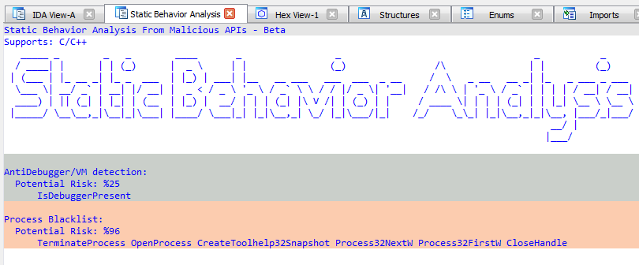

# Static Behavior Analysis From Malicious API for IDA Pro
[EN]

A plugin developed for IDA Pro that statically analyzes behavior by looking at the APIs used by executable. Only supports C/C++

[TR]

IDA Pro için geliştirilen, executable'ın kullandığı API'lara bakarak statik olarak davranış analizi yapan bir eklenti. C/C++ destekler.

## Example

